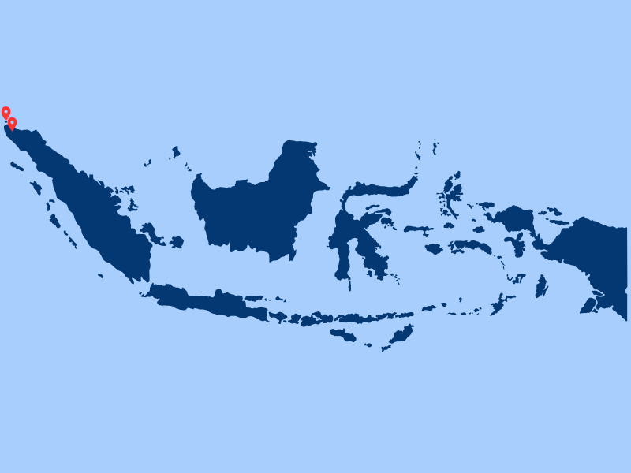

<div align="center">
  <div style="display: flex; justify-content: center; align-items: center; gap: 30px; margin-bottom: 20px;">
    
    
    
  </div>
  
  <br />
  
  

  <h1>Desa Berdaya PLN UID Aceh</h1>
  
  <p>
    <strong>A Comprehensive Information System & Management Platform for PLN's Desa Berdaya Program at Unit Induk Distribusi (UID) Aceh</strong>
  </p>

  <p>
    <a href="#-about-the-project">About</a> •
    <a href="#-key-features">Features</a> •
    <a href="#-system-architecture">Architecture</a> •
    <a href="#-tech-stack">Tech Stack</a> •
    <a href="#-installation">Installation</a> •
    <a href="#-contributors">Contributors</a>
  </p>
</div>

---

## 📖 About the Project

**Desa Berdaya PLN UID Aceh** is an integrated digital platform engineered specifically to support, monitor, and seamlessly manage the Corporate Social Responsibility (CSR) and Environmental Social Responsibility (TJSL) programs executed by **PT PLN (Persero) Unit Induk Distribusi (UID) Aceh**. 

The primary objective of this system is to bridge the gap between corporate empowerment initiatives and rural community development. By digitalizing village administration processes, tracking the progress of local economic programs, and ensuring absolute transparency in aid distribution, this platform acts as a catalyst for sustainable development across the UID Aceh operational areas.

This project was developed as a strategic form of synergy and tangible contribution to advancing rural communities in Aceh. It aligns perfectly with the overarching vision of the Ministry of State-Owned Enterprises (BUMN), the strategic goals of PLN, and the developmental blueprints of the Local Government.

## ✨ Key Features

This platform provides a robust suite of tools tailored for multiple stakeholders:

- **Comprehensive Village Profile Management:** 
  - Allows for detailed recording and continuous updating of target villages.
  - Captures critical data points including local economic potential, existing infrastructure, demographic statistics, and geographic mapping.
- **Real-Time CSR/TJSL Program Monitoring:** 
  - Enables stakeholders to track the end-to-end progress of aid distribution and empowerment programs initiated by PLN UID Aceh.
  - Includes milestone tracking and visual progress indicators to ensure projects remain on schedule.
- **Digital-Based Reporting & Accountability System:** 
  - Replaces manual paperwork with an automated, accurate, and transparent reporting mechanism.
  - Facilitates the generation of activity logs and financial fund usage reports that can be audited and verified easily.
- **Interactive Analytics & Data Dashboard:** 
  - Transforms raw data into actionable insights through statistical data visualization.
  - Features informative charts, graphs, and metrics that highlight village development trends and measure overall program success.
- **Multi-Role Access Control (RBAC):** 
  - A secure and integrated login architecture with specific privileges tailored for different user groups:
    - **PLN UID Aceh Management:** For high-level oversight, approval workflows, and strategic analytics.
    - **Village Officials:** For direct data input, updating local progress, and requesting support.
    - **General Public/Stakeholders:** For transparent viewing of program impacts and community achievements.

## 🏗️ System Architecture

*(Optional section to describe your system flow. You can adjust this based on your actual database and flow structure)*

The application follows a modern Model-View-Controller (MVC) architectural pattern, ensuring clean separation of concerns. The backend handles complex business logic, database transactions, and serves secure APIs, while the frontend provides a responsive, intuitive, and user-friendly interface accessible across various devices.

## 💻 Tech Stack

This project leverages modern, scalable, and reliable technologies:

**Frontend Ecosystem:**
  

**Backend Ecosystem:**
  

**Tools, Design & Environment:**
   

*(Note: Please adjust the stack badges above according to the specific framework versions and libraries actually used in your repository).*

## 🚀 Installation & Setup

Follow these comprehensive steps to set up and run the project locally on your machine:

### Prerequisites
Make sure you have the following installed:
- [Node.js](https://nodejs.org/) & npm (for frontend dependencies)
- [Composer](https://getcomposer.org/) (for PHP dependencies)
- A local web server stack (e.g., [XAMPP](https://www.apachefriends.org/), [Laragon](https://laragon.org/), or Laravel Herd)
- [Git](https://git-scm.com/)

### Step-by-Step Guide

1. **Clone this repository:**
   ```bash
   git clone https://github.com/dappahsn/Desa-Berdaya-PLN-UID-ACEH.git
   ```

2. **Navigate to the project directory:**
   ```bash
   cd Desa-Berdaya-PLN-UID-ACEH
   ```

3. **Install Dependencies:**
   Install backend and frontend dependencies:
   ```bash
   composer install
   npm install
   ```

4. **Environment Configuration:**
   - Duplicate the `.env.example` file and rename it to `.env`:
     ```bash
     cp .env.example .env
     ```
   - Open the `.env` file and configure your database credentials:
     ```env
     DB_CONNECTION=mysql
     DB_HOST=127.0.0.1
     DB_PORT=3306
     DB_DATABASE=desa_berdaya_db
     DB_USERNAME=root
     DB_PASSWORD=
     ```
   - Generate the application key:
     ```bash
     php artisan key:generate
     ```

5. **Database Setup & Seeding:**
   Run the migrations to create tables and seed them with initial/dummy data:
   ```bash
   php artisan migrate --seed
   ```

6. **Run Local Server:**
   You will need to run both the backend server and the frontend asset bundler simultaneously in separate terminal windows:
   
   **Terminal 1 (Backend):**
   ```bash
   php artisan serve
   ```
   
   **Terminal 2 (Frontend):**
   ```bash
   npm run dev
   ```

   The application should now be accessible at `http://localhost:8000`.

## 📂 Logo & Assets Structure
The visual assets and institutional logos utilized in this documentation and within the application interface are stored securely in the `img/` directory:
- `bumn-header.png` - Official Ministry of BUMN Logo
- `plnpeduli-header.png` - Official PLN Peduli Logo
- `bandaaceh-header.png` - Official Banda Aceh City Government Logo
- `Peta-Desa-Berdaya.png` - Main Application Illustration / Graphic Asset

*(If any images fail to load on GitHub, ensure that the file paths and names match exactly with the files in your repository, including case sensitivity).*

## 👨‍💻 Contributors

This project is actively maintained and developed by:

- **Muhammad Daffa Husen** 
  - Computer Engineering Student, Universitas Syiah Kuala
  - Role: Fullstack Developer / Lead Engineer
  - GitHub: [@dappahsn](https://github.com/dappahsn)
  - LinkedIn: [Muhammad Daffa Husen](https://www.linkedin.com/in/muhammad-daffa-husen/) *(Update with your actual LinkedIn if desired)*

## 📄 License
This software is distributed under the **MIT License**. See the `LICENSE` file in the root directory for more detailed information regarding terms of use and distribution.

---
<p align="center">
  <b>Empowering Communities, Illuminating the Future.</b><br>
  Made with ❤️ in Banda Aceh, Aceh, Indonesia.
</p>
